- [LC – 2 SIMULATOR](#lc-%E2%80%93-2-simulator)
  * [Overview:](#overview)
  * [Architecture:](#architecture)
  * [Instruction Set:](#instruction-set)
    + [Operate Instructions:](#operate-instructions)
    + [Data Movement Instructions:](#data-movement-instructions)
    + [Control Instructions:](#control-instructions)
  * [Instruction Cycle:](#instruction-cycle)
    + [FETCH:](#fetch)
    + [DECODE:](#decode)
    + [EVALUATE ADDRESS:](#evaluate-address)
    + [OPERAND FETCH:](#operand-fetch)
    + [EXECUTE:](#execute)
    + [STORE RESULT:](#store-result)
  * [Data Path:](#data-path)
    + [SIMULATOR](#simulator)
  * [Editor:](#editor)
    + [Mnemonics Pad:](#mnemonics-pad)
    + [Number Pad:](#number-pad)
    + [Registers Pad:](#registers-pad)
    + [Instruction Help:](#instruction-help)
    + [Bitwise Instruction Indicator:](#bitwise-instruction-indicator)
    + [Program Area:](#program-area)
    + [Segment Selector:](#segment-selector)
    + [Execution:](#execution)
    + [Tool Bar:](#tool-bar)
    + [New:](#new)
    + [Open:](#open)
    + [Save:](#save)
    + [Run Mode:](#run-mode)
    + [Step Mode:](#step-mode)
    + [Stop:](#stop)
    + [Output Summary:](#output-summary)
    + [File Information:](#file-information)
  * [Simulation Panel:](#simulation-panel)
    + [Data Flow Path Panel:](#data-flow-path-panel)
    + [Registers Panel:](#registers-panel)
    + [Instruction Summary Panel:](#instruction-summary-panel)
  * [How to build and run:](#how-to-build-and-run)
  
# LC – 2 SIMULATOR

## Overview:

LC-2 Simulator is used to run the Assembly Code of LC-2 Microprocessor. This software simulates the execution of instructions coded by the user and displays the instruction execution step by step. The simulation includes,

*   Display of how registers R0 to R7, Program Counter, Positive, Negative, Zero flag are getting affected. 
*   Simulation of Data flow path for every micro instruction that constitutes an instruction.
*   Summary of all the micro instructions that are getting executed.

## LC-2 Simulator in action:

## Architecture:

LC-2 is a **Reduced Instruction Set Computer.**

It has:

*   8 Registers starting from R0 to R7, 
*   Program Counter, 
*   Flags (Positive, Negative, Zero)

Registers are of size 16 bits.

Total Addressable memory is 1 MB.

Memory is divided into Segments. Every segment can address up to 256 memory 
locations. So there are 52 segments.

## Instruction Set:

Following are the Instruction types support by LC-2

### Operate Instructions:

The Operate instructions include: 

*   Arithmetic Operations ADD, SUB, MUL and DIV
*   Logical Operations AND, OR, NOT, XOR

### Data Movement Instructions:

These instructions include:

*   80LD (Load), LDR (Load Register), LDI (Load Indirect), LEA (Load Effective Address), ST (Store), STR (Store Register), STI (Store Indirect).
*   Different modes of addressing includes,
*   Immediate mode
*   Direct Mode
*   Indirect Mode
*   Base + Offset Mode

### Control Instructions:

Control Instructions change the sequence of the instructions that are executed.

These include:

*   BR (Break based on P, Z, N flag conditions)
*   JMP (Jump)
*   JSR (Jump Subroutine)
*   JMPR (Jump Register)
*   JSRR (Jump Subroutine Register)
*   RET (Return)
*   TRAP

## Instruction Cycle:

### FETCH:

* The instruction cycle starts with FETCH phase. The instruction is obtained by accessing memory with the address contained in the PC. 
* In the first cycle, the contents of the PC are loaded via the global bus into the MAR, and the PC is incremented and loaded into the PC. At the end of this cycle, the PC contains location.
* In the next cycle, the memory is read, and the instruction is loaded into the MDR (Memory Data Register). 
* In the next cycle, the contents of the MDR are loaded into the Instruction Register (IR), completing the FETCH phase.

### DECODE:
In the next cycle, the contents of the IR are decoded, resulting in the control logic providing the correct control signals to control the processing of the rest of this instruction. The opcode is identified.

### EVALUATE ADDRESS:
In the next cycle, the address of location is evaluated using ZERO Extension or SIGN Extension.

### OPERAND FETCH:
In the next cycle the data at the address is loaded into the MDR

### EXECUTE:
The instruction is executed.

### STORE RESULT:
The last cycle in which the results are stored.

## Data Path:

The data path reveals how the data is sent and manipulated among various components of the Microprocessor.

The basic components of Data path includes,

*   Global bus
*   Memory
*   ALU and Register File
*   PC and PCMUX (PC Multiplexer)
*   MARMUX (Memory Address Register Multiplexer)

### SIMULATOR

## Editor:

The Figure shows the EDITOR part of the SIMULATOR. This editor is used to write LC-2 Code. The editor has following components.

*   Mnemonics Pad
*   Number Pad
*   Register Pad
*   Program Area
*   Segment Selector
*   Instruction Help
*   Bitwise Instruction Indicator
*   Tool Bar
*   File Information

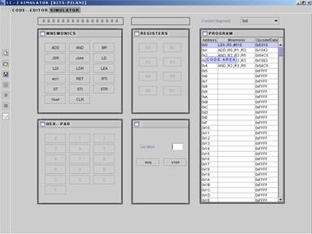

### Mnemonics Pad:

<table>
  <tr>
   <td>

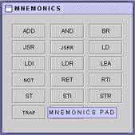

   </td>
   <td>Mnemonics Pad provides buttons for all the instructions to be coded in the <strong>Program Area.</strong>

Every Instruction (Mnemonics) is provided with a context sensitive help (ToolTipText) which shows the entire instruction format that will be used to complete the coding of an instruction.
   </td>
  </tr>
</table>

### Number Pad:

<table>
  <tr>
   <td>

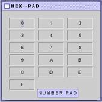

   </td>
   <td>Number Pad is used to give input like 

Memory location, Data.

Features are provided in such a way that if user needs to give Hexadecimal data, all the buttons will be enabled. If the user wants to give 2 bit data, only button 0,1,2,3 will be enabled. In the same way for 1 bit data, 0, 1 alone will be enabled.
   </td>
  </tr>
</table>

### Registers Pad:

<table>
  <tr>
   <td>

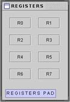

   </td>
   <td>Registers pad is used to select Source, Destination or Base Register as a part of the instruction to be coded.
   </td>
  </tr>
</table>

### Instruction Help:

<table>
  <tr>
   <td>

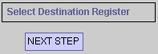

   </td>
   <td>This panel shows the help about what is the next step that the user has to do so as to complete coding the instruction
   </td>
  </tr>
</table>

### Bitwise Instruction Indicator:

<table>
  <tr>
   <td>

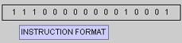

   </td>
   <td>This Instruction Indicator panel shows the BITWISE value of the 16 bit instruction being coded by the user.
   </td>
  </tr>
</table>

### Program Area:

<table>
  <tr>
   <td>

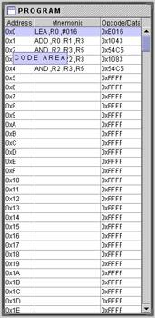

   </td>
   <td>  The Program area is the Internal window where the user writes instructions.

  The user can write the code by selecting appropriate buttons from Mnemonics pad, Numbers pad, Registers Pad.

  The program area has 3 columns.

<strong>Address</strong>: This represents the memory location.

<strong>Mnemonic</strong>: The mnemonic of the opcode stored.

<strong>Opcode</strong>: The Opcode stored in that memory location.

  User cannot edit Address and Mnemonic Column. However, he can change the Opcode or data present by double clicking the cell.

  Program area at a time can show memory locations corresponding to the SEGMENT selected in the SEGMENT SELECTOR.
   </td>
  </tr>
</table>

### Segment Selector:

<table>
  <tr>
   <td>

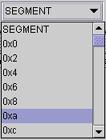

   </td>
   <td>  Segment Selector is used to select the segments of the memory location.

   When the user does coding and if the memory location in the program area reaches the end of the segment, the segment is automatically changed to next segment value and program area is loaded with the new memory locations of the segment changed.
   </td>
  </tr>
</table>

### Execution:

<table>
  <tr>
   <td>

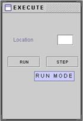

   </td>
   <td>After coding the program, the user can execute the program by giving the <strong><em>starting memory location</em></strong> and he can choose among either <strong><em>RUN or STEP</em></strong> mode. 

The <strong><em>Starting Memory Location </em></strong>need to be 4 Digit Hexadecimal number, else error message is displayed.

In <strong><em>RUN </em></strong>mode the simulation is shown and the user cannot change the contents of the Registers and Program Counter.

In <strong><em>STEP</em></strong> mode the simulation is shown and user can change the contents of the Register and Program Counter.
   </td>
  </tr>
</table>

### Tool Bar:

<table>
  <tr>
   <td>

   </td>
   <td>The tool bar has buttons for <strong><em>NEW FILE, OPEN FILE, SAVE FILE, EXECUTE, STEP, STOP, OUTPUT SUMMARY.</em></strong>

Depending upon the mode of execution selected (STEP or RUN), the buttons in the tool bar are disabled.
   </td>
  </tr>
</table>

### New:

<table>
  <tr>
   <td>

   </td>
   <td>This option is used to create a <strong><em>NEW </em></strong>file for coding the program. If the previous program is not saved, message will be displayed asking whether to save the previous program or not.
   </td>
  </tr>
</table>

### Open:

<table>
  <tr>
   <td>

   </td>
   <td>This option is used to open a file with extension <strong><em>".LC2" </em></strong>or <strong><em>".lc2"</em></strong> extension. Any file other than this extension cannot be opened. If the previous program is not saved, message will be displayed asking whether to save the previous program or not.
   </td>
  </tr>
</table>

### Save:

<table>
  <tr>
   <td>

   </td>
   <td>This option is to <strong><em>SAVE </em></strong>the file. If the file with extension <strong><em>.LC2 or .lc2</em></strong> is given it will be saved as such, else extension will be added and saved.
   </td>
  </tr>
</table>

### Run Mode:

<table>
  <tr>
   <td>

   </td>
   <td>This option is to set the program under execution in <strong><em>RUN </em></strong>mode. In <strong><em>RUN</em></strong> mode the user cannot edit the values of <strong><em>REGISTER </em></strong>and <strong><em>Program Counter.</em></strong>
   </td>
  </tr>
</table>

### Step Mode:

<table>
  <tr>
   <td>

   </td>
   <td>This option is to set the program under execution in <strong><em>STEP </em></strong>mode. In <strong><em>STEP </em></strong>mode the user can edit the values of <strong><em>REGISTER </em></strong>and <strong><em>Program Counter.</em></strong>
   </td>
  </tr>
</table>

### Stop:

<table>
  <tr>
   <td>

   </td>
   <td>This option is to <strong><em>STOP </em></strong>the program under execution.
   </td>
  </tr>
</table>

### Output Summary:

<table>
  <tr>
   <td>

   </td>
   <td>This option shows the <strong><em>Summary of Output,</em></strong> which includes all the contents of <strong><em>REGISTER, PC, and Flag</em></strong> for every instruction that was executed.
   </td>
  </tr>
</table>

### File Information:

<table>
  <tr>
   <td>

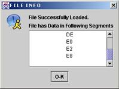

   </td>
   <td>When a file is opened, Mnemonics, instructions, data are loaded.

This dialog shows the segments in which Mnemonics, instructions and data are found in the file, so that user can begin executing from any of those memory locations.
   </td>
  </tr>
</table>

## Simulation Panel:

The **SIMULATION Panel** consists of

*   Data Flow Path Panel
*   Registers Panel
*   Instruction Summary Panel

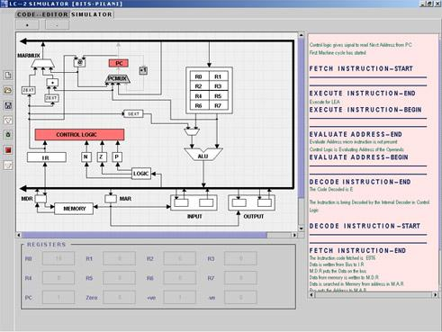

### Data Flow Path Panel:

Data Flow Path Panel represents the flow of data among various components of the **_Microprocessor_** including

*   Registers (R0 – R7)
*   ALU (Arithmetic and Logic Unit)
*   Global Bus
*   Control Logic
*   Instruction Register (IR)
*   Memory
*   Memory Address Register (MAR)
*   Memory Data Register (MDR)
*   Program Counter (PC)
*   MARMUX (Memory Address Register Multiplexer)
*   PCMUX (Program Counter Multiplexer)
*   SEXT (Sign Extension)
*   ZEXT (Zero Extension)
*   Logic
*   Zero, Negative, Positive Flag

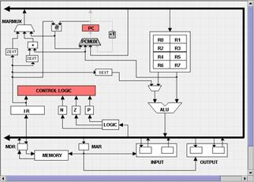

### Registers Panel:

* Registers Panel is used to display the _contents _of **_Registers, PC, Zero, Negative, Positive Flags _**during the execution of every instruction.
* If the program is in **_STEP MODE_**, then user can modify the contents of **_Registers, PC_** after every instruction if he desires.
* The value that can be given ranges from 0 to FFFF (Hexadecimal). If invalid data is given, _error message _will be displayed and values will not be set.

	

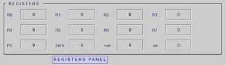

### Instruction Summary Panel:

The **_Instruction Summary Panel_** shows the summary of execution of every instruction that was executed in the program. The summary shows the contents of 

*   Registers (R0 – R7)
*   Program Counter,
*   Positive flag,
*   Negative flag,
*   Zero flag.

	

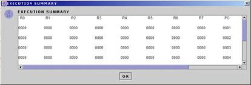

## How to build and run:

* mvn clean install
* java -jar $PROJECT_HOME/target/lc2-simulator-$PROJECT_VERSION.jar
* Once the simulator starts, use any of the files from `src/main/resources` having `.LC2` extension for samples.
* Once a ".LC2" file is chosen, a dialog prompt states where the `code instructions` are present i.e., the `segment number`.
  * From the drop down `Current Segment`, pick the segment that has `instructions`
  * In the `Execute` panel, provide the `Address` from where the code execution should begin from.
  * Press `Run` or `Step` to start the simulation.
* Once the code execution starts, simulation pane will start showing the instruction execution in `graphical` format.
  * If `Step` mode of execution was chosen, press the `Debug` icon on the tool bar to continue execution step by step or choose `Run` icon to finish executing all instructions.  